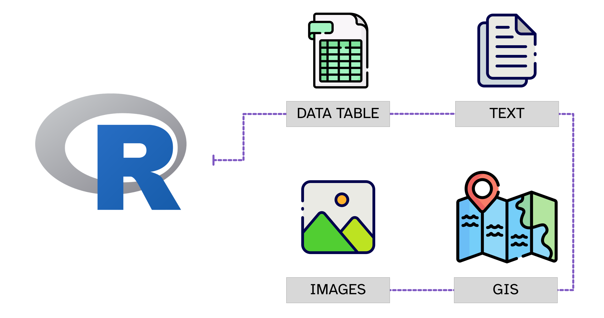
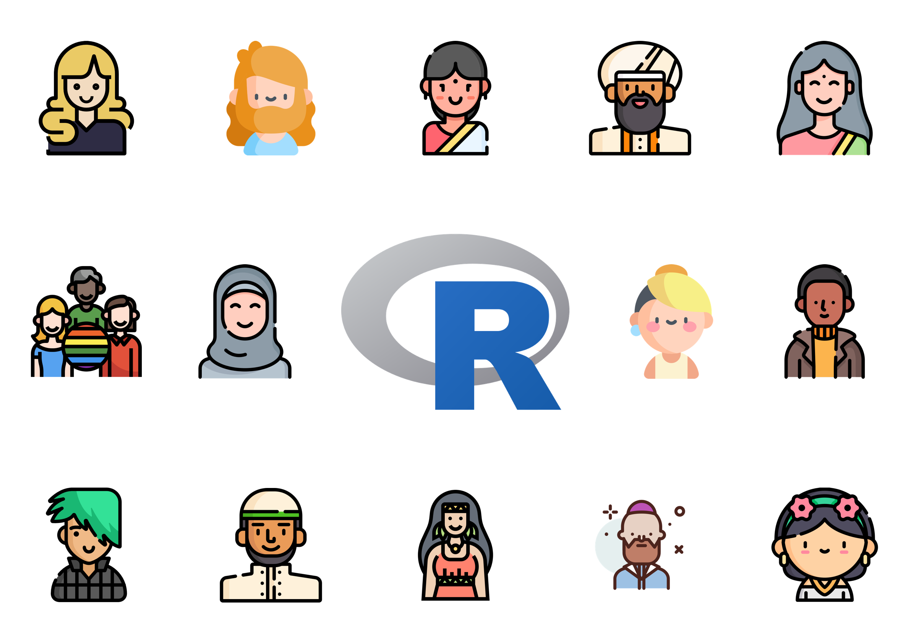

```{r setup, include=FALSE}
options(htmltools.dir.version = FALSE)
knitr::opts_chunk$set(
  fig.width=9, fig.height=3.5, fig.retina=3,
  out.width = "100%",
  cache = FALSE,
  echo = TRUE,
  message = FALSE, 
  warning = FALSE,
  hiline = TRUE
)
xaringanExtra::use_xaringan_extra(c("panelset", "tachyons"))
```

```{r xaringan-themer, include=FALSE, warning=FALSE}
library(xaringanthemer)
style_mono_light()
```

background-image: url(../img/mia-anderson-xzE4-0gSYuo-unsplash.jpg)
background-size: cover

.pull-right.f1[**Welcome!**]

???

Photo by <a href="https://unsplash.com/@miaanderson?utm_source=unsplash&utm_medium=referral&utm_content=creditCopyText">Mia Anderson</a> on <a href="https://unsplash.com/s/photos/happy-dog?utm_source=unsplash&utm_medium=referral&utm_content=creditCopyText">Unsplash</a>

---

class: inverse middle

.f1[What is data?]

---

class: middle center


---

background-image: url(../img/big-data-analysis-1024x576.jpg)
background-size: cover

---

class: middle center



---

class: middle center



---

layout: true

# R vs RStudio

---


---

.pull-left[
.f2[R]

- R is a **programming language**.

- We use programming languages to **interact** with computers.

- You **run commands** written in a console and the related task is executed.
]

--

.pull-right[
.f2[RStudio]

- RStudio is an Integrated Development Environment or **IDE**.

- It helps you using R more efficiently.

- It has a graphical interface.
]

---


---

layout: false
class: middle center inverse

.f1[RSTUDIO TOUR]

---

class: middle center inverse

.f1[TUTORIAL]
